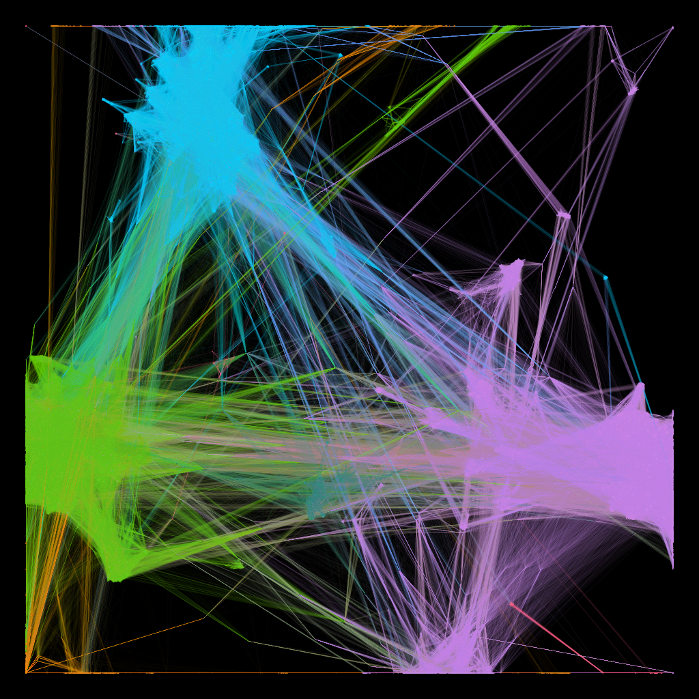
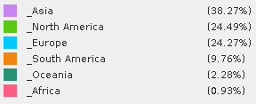

## Data is Beautiful DataViz November 2019 Submission

Competition post here: https://www.reddit.com/r/dataisbeautiful/comments/drgz68/battle_dataviz_battle_for_the_month_of_november/

### WCA Competitor Network in 2018

##### Colour Key

##### Comment
The above is a visualization of the 2018 WCA Competitor Network.  Connections between competitors are defined as having competed in the same competition in 2018.  The colours are defined by continent the competitor is from.

##### Process
I included a jupyter notebook in this repo which outlines my process for compiling and shaping the data for analysis: 

I created the chart using Gephi (on Docker, https://hub.docker.com/r/dit4c/dit4c-container-gephi).

##### Data Source

https://www.worldcubeassociation.org/results/misc/export.html

> This information is based on competition results owned and maintained by the
> World Cube Assocation, published at https://worldcubeassociation.org/results
> as of November 30, 2019.

###### Acknowledgements

The WCA database was originally created and maintained by:

- Clément Gallet, France
- Stefan Pochmann, Germany
- Josef Jelinek, Czech Republic
- Ron van Bruchem, Netherlands

The database contents are now maintained by the WCA Results Team, and the
software for the database is maintained by the WCA Software Team:
https://www.worldcubeassociation.org/about
